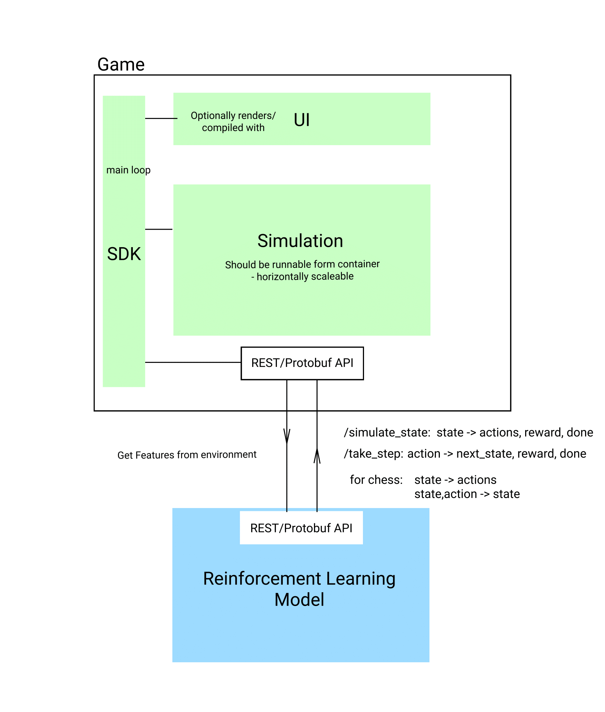

# Bento Box
This project aims to develop a game engine that can simulate multiple environments in at least 2D corresponding to a task/problem. In addition, the game engine should be relatively performant.

To demonstrate an application on simulations offered by the game engine, we will train an agent powered by a reinforcement learning model to accomplish the task defined by the simulation.

